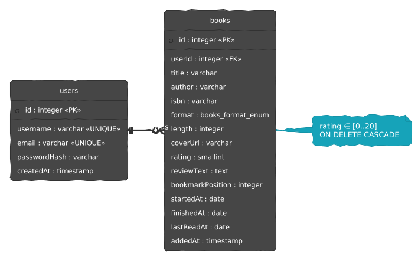
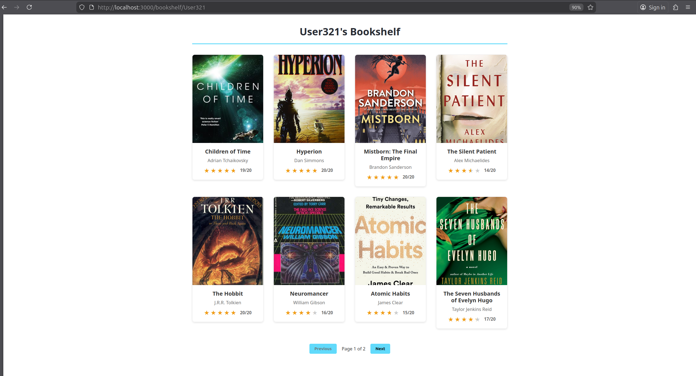
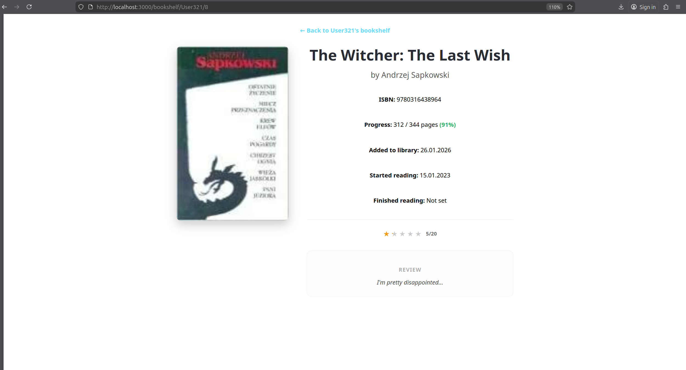

# Bookshelf
Bookshelf is a web application designed for readers who want to digitize and manage their personal book collections.
Each book represents a specific copy on a user's shelf, including reading progress and a review.
The project's goal is to provide readers a platform to organise their home libraries, monitor their reading progress, and preserve a history of reviews and ratings, as well as share their bookshelf with the world.
Every library is public and any user can views anyone's library if they know their username.  

# Roadmap

The project is a work-in-progress, and not all planned features have been fully implemented yet.

## Infrastructure & DevOps
- [x] Docker Integration: Fully containerized environment.
    - [x] compose.dev.yaml for local development with hot-reload.
    - [x] compose.prod.yaml for production-ready deployment.
- [x] API Documentation: Automated Swagger/OpenAPI documentation.

## Security and Auth:
- [x] JWT Authentication: Secure token-based communication between Frontend and Backend.
- [ ] User Access:
    - [x] Backend logic for Register/Login.
    - [ ] Frontend UI for Authentication.

## Core Business Logic:
- [x] Public Library Access: Users can browse collections of other registered users. 
    - [x] List book view
    - [x] Detailed book view
- [ ] Advanced Browsing: Search and filter
    - [ ] Search for a book by title or author
    - [ ] Sort/Filter books depending on reading status: tbr, in-progress or read
    - [ ] Sort/Filter books depending on their rating
    - [ ] Sort/Filter books depending on page count
    - [ ] Sort/Filter books depending on format (physical/digital/audiobook)
- [ ] Collection Management: Add, edit, and remove books from your digital shelf.
    - [x] CRUD operations for books (Backend).
    - [ ] Library management dashboard (Frontend).
- [ ] Progress tracking: Visual indicators for reading progress (% of book read).
    - [x] Progress visualization on Frontend.
    - [ ] Interactive progress updates (Frontend UI)

# Technologies used
## Backend:
* NodeJS
* NestJS
* TypeScript
* TypeORM
* Swagger
* JWT
* PostgreSQL
## Frontend:
* React using CRA
* Axios
* Typescript
## Infrastructure & Tools:
* Docker & Docker Compose
* Git


# Installation & Getting started
## Prerequisites
* Docker & Docker Compose: The primary tool for running the application.
* Git: To clone the repository. (Optional)
### Windows Requirements
Docker Desktop on Windows requires WSL 2 (Windows Subsystem for Linux) to run containers efficiently.
* Ensure WSL 2 is installed on your system.
* In Docker Desktop settings, verify that WSL 2 integration is enabled.
> Note: If WSL 2 is missing, Docker Desktop will prompt you to install it during setup.
## Setup
### Cloning the repository
If you have git, you can clone the repository using this command in your terminal:
```
git clone https://github.com/aspencode/bookshelf-webapp
cd bookshelf-webapp
```
If you don't have git, you can download the code manually using github's UI.
### Envinroment configuration
Create a local environment file by copying the provided example. This file contains database credentials and API configuration.
Replace the example values by your own as you wish.

There are two envinroment files: one in the main folder (.) and one inside frontend (./frontend)


```
cp .env.example .env
cp ./frontend/.env-example ./frontend/.env
```


## Running the application
### Development mode
Use this mode if you plan to modify the code. It includes hot-reload, so changes in your files will reflect immediately.
```
docker compose -f compose.dev.yaml build
docker compose -f compose.dev.yaml up
```
### Production mode
Use this mode to see how the application performs in a stable, optimized environment.
```
docker compose -f compose.prod.yaml build
docker compose -f compose.prod.yaml up
```

## Accessing the services
Once the containers are up and running, you can access the following interfaces:
| Service     | URL                            | Description                                     |
|-------------|--------------------------------|-------------------------------------------------|
| Frontend    | http://localhost:3000          | The main web application interface.             |
| Backend API | http://localhost:3001          | The REST API server.                            |
| Swagger UI  | http://localhost:3001/api-docs | Interactive API documentation and testing tool. |


## Code and Configuration
### Version Control

The project is maintained in a Git repository hosted on GitHub.
Git is used for:
* tracking incremental development,
* separating features into logical commits,
* enabling reproducible builds and deployments.

The repository contains both frontend and backend code in a single mono-repository, which simplifies development and deployment using Docker Compose.

### Configuration Files

The application relies on environment-based configuration.

Key configuration files include:

* .env – backend configuration (database, JWT secret, ports),
* frontend/.env – frontend configuration (API base URL),
* compose.dev.yaml – Docker Compose configuration for development,
* compose.prod.yaml – Docker Compose configuration for production.

Environment variables are used to avoid hardcoding sensitive data such as database credentials and secret keys.

# Implemented Features
## User and Library Features

### Public user libraries
Every user has a publicly accessible bookshelf available under `/bookshelf/{username}`.
Any visitor can browse a user’s collection without authentication.
###  Book representation
Each book represents a concrete copy owned by a user, including:
* title and author,
* format (physical, digital, audiobook),
* reading progress,
* rating and review text.
### Reading progress tracking
The application supports tracking reading progress using:
* bookmark position,
* start and finish dates,
* last read date,
* visual progress indicators on the frontend.

# Project structure
## From the main file
```
.
├── api
├── assets
├── compose.dev.yaml
├── compose.prod.yaml
├── frontend
├── package-lock.json
└── README.md
```
## Backend (API)
```
.
├── Dockerfile.dev
├── Dockerfile.prod
├── eslint.config.mjs
├── nest-cli.json
├── package.json
├── package-lock.json
├── src
│   ├── app.controller.spec.ts
│   ├── app.controller.ts
│   ├── app.module.ts
│   ├── app.service.ts
│   ├── auth
│   │   ├── auth.module.ts
│   │   ├── auth.service.spec.ts
│   │   ├── auth.service.ts
│   │   ├── jwt-auth.guard.ts
│   │   └── jwt.strategy.ts
│   ├── books
│   │   ├── books.controller.spec.ts
│   │   ├── books.controller.ts
│   │   ├── books.module.ts
│   │   ├── books.service.spec.ts
│   │   ├── books.service.ts
│   │   ├── dto
│   │   │   ├── create-book.dto.ts
│   │   │   └── update-book.dto.ts
│   │   ├── entities
│   │   │   └── book.entity.ts
│   │   └── enums
│   │       └── book-format.enum.ts
│   ├── data-source.ts
│   ├── main.ts
│   └── users
│       ├── dto
│       │   ├── create-user.dto.ts
│       │   ├── login.dto.ts
│       │   ├── update-user.dto.ts
│       │   └── user-response.dto.ts
│       ├── entities
│       │   └── user.entity.ts
│       ├── users.controller.ts
│       ├── users.module.ts
│       └── users.service.ts
├── test
│   ├── app.e2e-spec.ts
│   └── jest-e2e.json
├── tsconfig.build.json
└── tsconfig.json

```
## Frontend
```
.
├── Dockerfile.dev
├── Dockerfile.prod
├── package.json
├── package-lock.json
├── public
│   ├── favicon.ico
│   ├── index.html
│   ├── manifest.json
│   └── robots.txt
├── README.md
├── src
│   ├── api.ts
│   ├── App.css
│   ├── App.test.tsx
│   ├── App.tsx
│   ├── components
│   │   ├── BookCard.tsx
│   │   └── StarRating.tsx
│   ├── index.css
│   ├── index.tsx
│   ├── pages
│   │   ├── BookDetailsPage.tsx
│   │   └── BookshelfPage.tsx
│   ├── react-app-env.d.ts
│   ├── reportWebVitals.ts
│   └── setupTests.ts
└── tsconfig.json

```
# Database structure



# Description of Main Code Elements
## Models
### User

represents a registered application user,
contains identification and authentication data (username, email, password hash),
acts as the owner of book entities.

### Book

represents a single book owned by a user,
contains metadata (title, author, ISBN, format),
stores reading-related data (progress, rating, review, dates),
is linked to a user via a foreign key relationship.
The relationship between User and Book is one-to-many, meaning a single user can own multiple books.
Database-level constraints such as UNIQUE, CHECK, and ON DELETE CASCADE are used to enforce consistency independently of application logic.

## Controllers

### AppController
AppController is a minimal controller responsible for exposing the root endpoint of the backend application.

*Responsibilities:*

* provides a basic health-check or test endpoint,

* verifies that the backend service is running correctly.

*Endpoints:*

* GET /
    * Returns a simple string response generated by AppService.

This controller is  used during development or deployment to confirm that the API is reachable.

### BooksController

BooksController handles all operations related to books and user libraries.
It exposes both public and authenticated endpoints.

*General responsibilities:*
* fetching books belonging to a specific user,
* retrieving detailed information about a single book,
* creating, updating, and deleting books for the authenticated user,
* enforcing access control using JWT authentication.

*Key characteristics:*
* routes are prefixed with /books,
* Swagger decorators document all endpoints,
* JWT guards protect endpoints that modify data.

*Public endpoints*
* GET /books/:userId
    * Returns a paginated list of books belonging to a given user.
    * supports page and limit query parameters,
    * enforces safe pagination (minimum 1, maximum 100 items per page),

* GET /books/details/:id
    * Returns full details of a single book.
    * returns 404 if the book does not exist,

These endpoints enable public browsing of user libraries.

*Authenticated endpoints*

The following endpoints are protected by JwtAuthGuard and require a valid JWT token:

* POST /books
    * Creates a new book entry for the authenticated user.
    * the user ID is extracted from the JWT token,
    * book data is validated using CreateBookDto.

* PATCH /books/:id
    * Updates an existing book owned by the authenticated user.
    * ensures that users can only modify their own books,
    * validated using UpdateBookDto.

* DELETE /books/:id
    * Deletes a book owned by the authenticated user.
    * returns an error if the book does not exist or does not belong to the user.
    * This design ensures that only authenticated users can modify their own libraries, while read access remains public.

### UsersController
UsersController manages user-related operations, including authentication and user lookup.
It acts as a bridge between the authentication system and user persistence.

*General responsibilities:*
* user registration and login,
* validating user existence,
* exposing user identifiers for frontend routing.

*Authentication endpoints*

* POST /users/login
    * Authenticates a user using username and password.
    * credentials are validated using UsersService,
    * on success, a JWT token is generated and returned,
    * invalid credentials result in an error.

* POST /users/register
    * Registers a new user.
    * user data is validated using CreateUserDto,
    * password hashing is handled at the service level,
    * automatically logs in the user after registration.

*User lookup endpoints*

* GET /users/:username
    * Checks whether a user with the given username exists.
    * used primarily by the frontend to validate routes,
    * returns user ID and username,
    * returns 404 if the user does not exist.

* GET /users/id/:id
    * Retrieves a user by their numeric ID.
    * returns minimal identifying data,
    * returns 404 if the user does not exist.

These endpoints are intentionally public and return limited information only, avoiding exposure of sensitive user data.

## Services
### AppService
AppService is a minimal utility service used by AppController.

*Responsibilities:*

* provides a simple response for the root endpoint,

* serves as a basic health-check and example of service usage.

*Functionality:*

* getHello() returns a static string confirming that the backend is operational.

This service does not interact with the database and exists primarily for structural completeness and testing.

### AuthService
AuthService handles authentication token generation using JSON Web Tokens (JWT).

*Responsibilities:*

* generating JWT access tokens after successful authentication,

* defining token payload structure.

*Key characteristics:*

* uses NestJS JwtService,

* embeds user identification data (sub, username) into the token payload,

* returns signed tokens to the controller.

This service does not validate credentials itself; instead, it relies on UsersService for user verification.
This separation of responsibilities improves modularity and testability.


### BooksService

BooksService manages all book-related business logic and database operations.
It interacts directly with the Book entity via a TypeORM repository.

*Main responsibilities:*

* fetching books for a specific user,

* enforcing pagination rules,

* retrieving book details,

* creating, updating, and deleting books,

* enforcing ownership-based access control.

*Key features:*

* Paginated retrieval

    * supports page-based pagination with configurable limits,

    * orders results by creation date,

    * returns metadata describing the result set (total items, pages, current page).

* Ownership enforcement

    * update and delete operations verify both book ID and user ID,

    * prevents users from modifying or deleting books they do not own.

* Error handling

    * throws NotFoundException when books are missing or inaccessible,

    * ensures meaningful error responses for invalid operations.

* Data integrity

    * relies on database constraints and service-level checks,

    * ensures consistent behavior even when accessed concurrently.

This service acts as the core of the application’s domain logic.

# Visuals
This section presents selected screenshots of the user interface to illustrate the main functionalities of the application.


## Bookshelf view
Displays a user’s public bookshelf with a list of added books, including basic metadata and reading progress.



## Book Card Component
A reusable UI component used throughout the application to present a concise summary of a book, such as title, author, format, and rating.


## Book Details View

Shows detailed information about a selected book, including extended metadata, review content, and reading status.



# Detailed Feature Implementation
## Public User Library Access with Pagination

This section presents a detailed implementation of the public access to a user’s bookshelf with pagination, one of the core features of the Bookshelf application.
The goal of this functionality is to allow any visitor to browse a user’s public book collection efficiently, without requiring authentication, while maintaining performance and data integrity.

### Functional Overview

Each registered user has a publicly accessible library available under the endpoint:

```GET /books/:userId```


This endpoint returns a paginated list of books owned by a given user. Pagination is mandatory to prevent excessive data transfer and to ensure scalability for large collections.

*Key characteristics of this feature:*

* public access (no authentication required),
* page-based pagination,
* safe limits enforced at the backend level

### Request Flow

1. The frontend sends a request containing:

    * the user identifier (userId) as a route parameter,
    * optional pagination parameters (page, limit).

2. The request is handled by BooksController.

3. Input parameters are validated and sanitized.

4. Business logic is delegated to BooksService.

5. Data is retrieved from the database using TypeORM.

6. A structured response containing data and pagination metadata is returned to the client.

### Controller Implementation

The public endpoint is implemented in BooksController:
```
@Get(':userId')
@ApiOperation({ summary: 'View any user’s library with pagination (max 100 items per page)' })
@ApiQuery({ name: 'page', required: false, example: 1 })
@ApiQuery({ name: 'limit', required: false, example: 10, description: 'Max 100 items' })
@ApiResponse({ status: 200, description: 'List of books returned successfully' })
getAllBooks(
  @Param('userId', ParseIntPipe) userId: number,
  @Query('page', new ParseIntPipe({ optional: true })) page: number = 1,
  @Query('limit', new ParseIntPipe({ optional: true })) limit: number = 10,
) {
  // Prevent invalid page numbers
  const validatedPage = page > 0 ? page : 1;

  // Enforce safe pagination limits (1–100 items per page)
  const safeLimit = limit > 0 ? Math.min(limit, 100) : 1;

  return this.booksService.findAllByUserId(userId, validatedPage, safeLimit);
}
```
*Key design decisions:*
* ParseIntPipe ensures type safety at the framework level.
* Pagination parameters are validated defensively.
* A hard limit of 100 items per page protects the API from abuse.

### Service Implementation

The actual data retrieval logic is implemented in BooksService:

```
async findAllByUserId(userId: number, page: number = 1, limit: number = 10) {
  const skip = (page - 1) * limit;

  const [data, total] = await this.bookRepository.findAndCount({
    where: { userId: userId },
    order: { addedAt: 'DESC' },
    take: limit,
    skip: skip,
  });

  return {
    data,
    meta: {
      totalItems: total,
      itemCount: data.length,
      itemsPerPage: limit,
      totalPages: Math.ceil(total / limit),
      currentPage: page,
    },
  };
}
```


*Explanation:*

* findAndCount() retrieves both the requested page data and the total number of records in a single database query.
* Results are sorted by creation date (addedAt DESC), ensuring consistent ordering.
* Pagination metadata allows the frontend to render navigation controls and page indicators.

### Response Structure

*Response structure - JSON code*
```
{
  "data": [
    {
      "id": 12,
      "title": "The Witcher: The Last Wish",
      "author": "Andrzej Sapkowski",
      "format": 1,
      "rating": 18
    }
  ],
  "meta": {
    "totalItems": 42,
    "itemCount": 10,
    "itemsPerPage": 10,
    "totalPages": 5,
    "currentPage": 1
  }
}
```

The response is separated into two sections: 
* data: contains all information about the book
    * may contain varied amount of fields, as not all fields are required for the book entity
* meta: contains all meta information:
    * totalItems – the total number of books owned by the user, regardless of pagination.
    * itemCount – the number of books returned in the current response page.
    * itemsPerPage – the maximum number of books allowed per page for this request.
    * totalPages – the total number of available pages based on totalItems and itemsPerPage.
    * currentPage – the index of the currently requested page.

*Example response*
```
{
  "data": [
    {
      "id": 44,
      "userId": 6,
      "title": "Atomic Habits",
      "author": "James Clear",
      "isbn": "9780735211292",
      "format": 3,
      "length": 320,
      "coverUrl": "https://images.gr-assets.com/books/1655988385l/40121378.jpg",
      "rating": 15,
      "reviewText": "Practical advice, though some parts feel repetitive.",
      "bookmarkPosition": 80,
      "startedAt": "2026-01-01",
      "finishedAt": null,
      "lastReadAt": "2026-01-20",
      "addedAt": "2026-01-27T07:56:51.417Z"
    },
    {
      "id": 43,
      "userId": 6,
      "title": "The Seven Husbands of Evelyn Hugo",
      "author": "Taylor Jenkins Reid",
      "isbn": "9781501161933",
      "format": 2,
      "length": 389,
      "coverUrl": "https://images.gr-assets.com/books/1664458703l/32620332.jpg",
      "rating": 17,
      "reviewText": "Very emotional and glamorous. Loved the storytelling format.",
      "bookmarkPosition": 389,
      "startedAt": "2024-06-15",
      "finishedAt": "2024-06-22",
      "lastReadAt": "2024-06-22",
      "addedAt": "2026-01-27T07:56:41.860Z"
    },
    {
      "id": 42,
      "userId": 6,
      "title": "Dune",
      "author": "Frank Herbert",
      "isbn": "9780441172719",
      "format": 1,
      "length": 617,
      "coverUrl": "https://images.gr-assets.com/books/1555447414l/44767458.jpg",
      "rating": 19,
      "reviewText": "World-building at its finest, though a bit dense in the middle.",
      "bookmarkPosition": 150,
      "startedAt": "2025-12-01",
      "finishedAt": null,
      "lastReadAt": "2025-12-28",
      "addedAt": "2026-01-27T07:56:33.047Z"
    },
    {
      "id": 41,
      "userId": 6,
      "title": "Project Hail Mary",
      "author": "Andy Weir",
      "isbn": "9780593135204",
      "format": 1,
      "length": 473,
      "coverUrl": "https://external-content.duckduckgo.com/iu/?u=https%3A%2F%2Fplanetary.s3.amazonaws.com%2Fweb%2Fassets%2Fpictures%2Fproject-hail-mary-cover-weir.jpg&f=1&nofb=1&ipt=6ab3700f82827ace8833599c756e1987f3d8871db700021c9dc0e99492accae2",
      "rating": 20,
      "reviewText": "Absolutely brilliant sci-fi. A masterclass in pacing.",
      "bookmarkPosition": 473,
      "startedAt": "2025-05-10",
      "finishedAt": "2025-05-20",
      "lastReadAt": "2025-05-20",
      "addedAt": "2026-01-27T07:56:18.310Z"
    },
    {
      "id": 8,
      "userId": 6,
      "title": "The Witcher: The Last Wish",
      "author": "Andrzej Sapkowski",
      "isbn": "9780316438964",
      "format": 1,
      "length": 344,
      "coverUrl": "https://cdn.thestorygraph.com/5brpbfo7dnvo7ubq2dgvpsxpyuiq",
      "rating": 5,
      "reviewText": "I'm pretty disappointed...",
      "bookmarkPosition": 312,
      "startedAt": "2023-01-15",
      "finishedAt": null,
      "lastReadAt": "2024-02-10",
      "addedAt": "2026-01-26T16:49:09.240Z"
    }
  ],
  "meta": {
    "totalItems": 13,
    "itemCount": 5,
    "itemsPerPage": 8,
    "totalPages": 2,
    "currentPage": 2
  }
}
```

### Database and Data Integrity

Each book is associated with its owner via a foreign key:

```
@ManyToOne(() => User, (user) => user.books, { onDelete: 'CASCADE' })
user: User;
```

*This guarantees that:*
* books cannot exist without a valid owner,
* deleting a user automatically removes their books,
* referential integrity is enforced at the database level.

### Frontend Integration

On the frontend, this endpoint is consumed by the BookshelfPage component.
Pagination metadata is used to:
* display the current page,
* limit the number of rendered items,
* enable future extensions such as sorting and filtering.